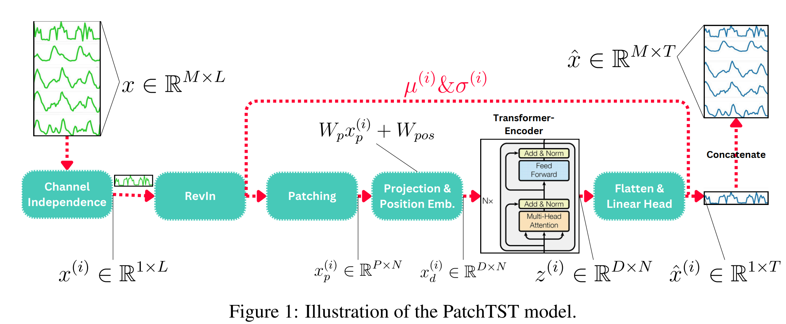
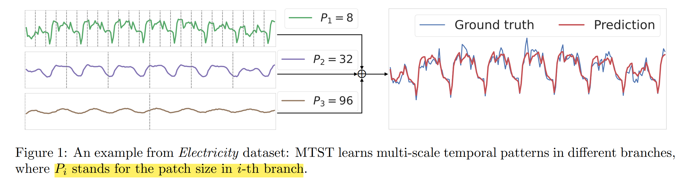
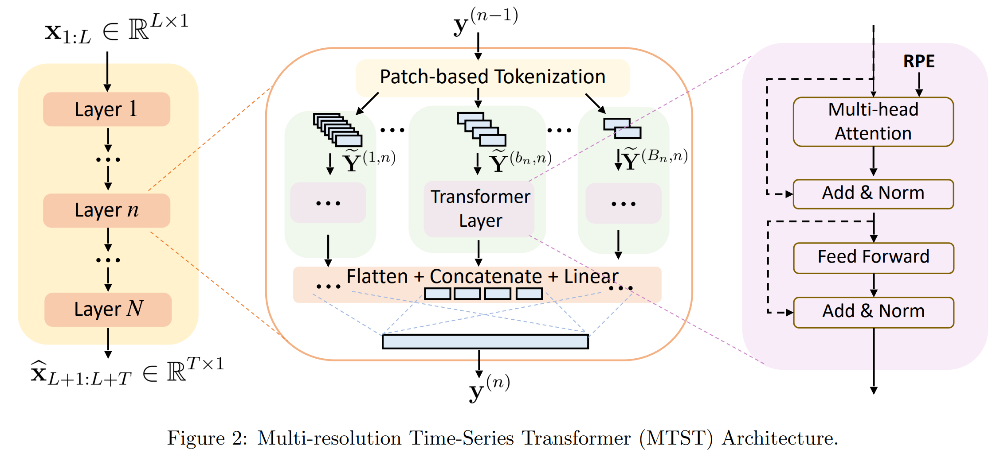
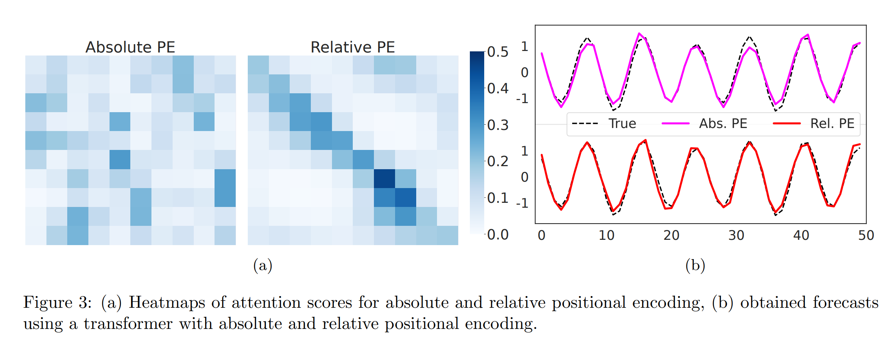
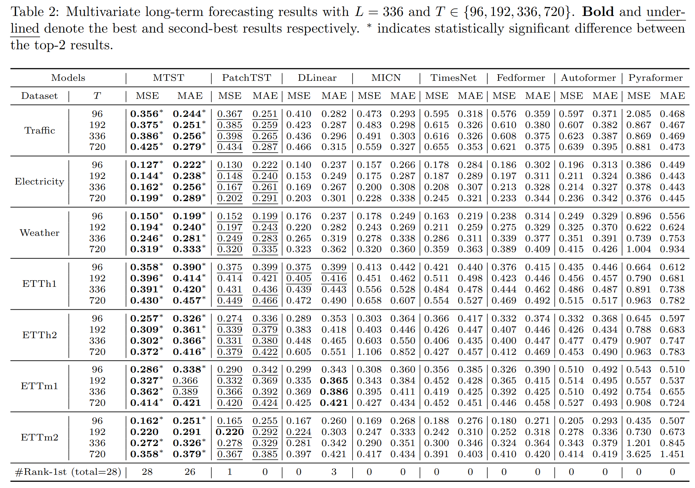
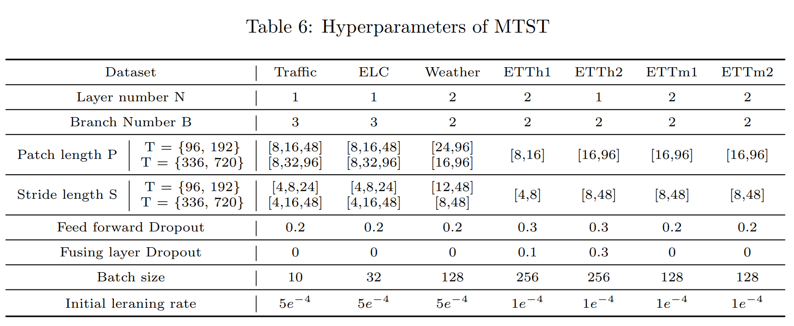
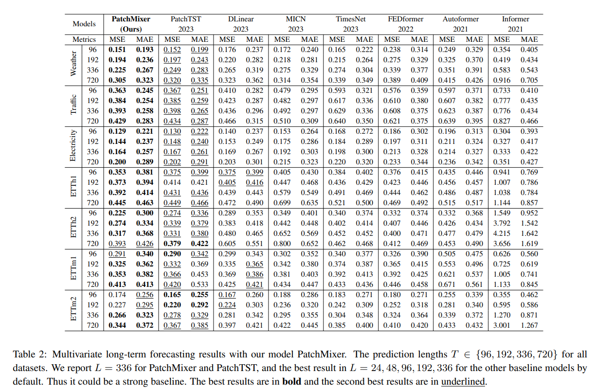
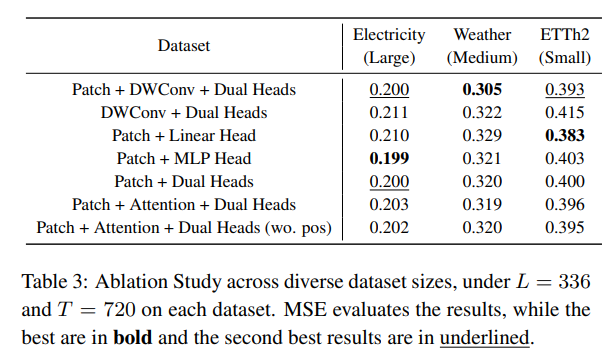

# Summary

- [Ideas](#ideas)
- [gluonts](#gluonts)
- [Seminar: PatchTST - Nie et al. 2023](#patchtst)
- [TSMixer - Chen et al. 2023](#tsmixer)
- [MTST - Zhang et al. 2024](#mtst)
- [PatchMixer - Gong et al. 2024](#patchmixer)
- [TiDE - Das et al. 2024](#tide)

Ideas

- **Probabilistic** Comparison (Better interpretability and decision making):
  - Ways to implement:
    - parameters of distribution and specific loss (log loss?) -> try different distributions
    - maybe try MonteCarlo (once turned probabilistic)
  - How to perform Probabilistic Evaluation:
    - Interval (WIS, Coverage)
    - full distribution (CRPS, WRMSSE)

 

- find a better way to utilize and combine the available information
  - Hierarchical patching:
    - use patching, but dynamically (and potentially series dependent):
      - determine the patch length to match the frequency of the underlying time series (maybe via FFT?) -> then feed patches to CNN/RNN to summarize the series information and implement it to the prediction of the target time series (= utilize TimesBlock from TimesNet?) -> could also be combined with semi CD approach (only top k most influential time series considered)
    - Patching with TSMixer -> Try out TSMixer while incorporating patching? (potentially on multiple levels like MTST)
    - PatchMixer -> use hierarchical patching levels but similar architecture?
    - Is Patching and MLP based architecture even reasonable? -> potentially loose out on some benefits of linear architecture (like modelling time-step dependent)
  - Use traditional methods to additionally extract similarities, frequencies and more 

 

- Channel dependent methods -> need for other evaluation benchmarks (see TSMixer)
  - methods to capture cross-channel information
    - CNN, RNN, ARIMA? (CNN/RNN in place of $MLP_{feat}$ of TSMixer)
    - maybe use CNN/RNN AR-methods for short term information and Transformer for long-term?
  - maybe include a parameter $\lambda$ to trade-off between CI and CD, for example by ranking the time series at hand and then only allowing information to pass from the most related ones (This could also benefit the discussion of the datasets -> which datasets have many related time series). Also investigate this with patches -> learn which patches of other time series are important, based on patch time point or patch length and considered time series
    - LIFT (Zhao and Zhen, 2024) also calculates cross correlation coefficient, but then reduces to leading indicators -> maybe just use this to rank the correlation and then weight the influence accordingly/only choose a percentage of the other series to consider?

 

- Consider auxiliary information -> again needs other benchmark than the standard (M5 like TSMixer)
  - This is especially relevant for TST based models -> could try to add auxiliary information into these models
  - look at how TiDE/TSMixer added auxiliary information into their model

 

- more implementation ideas:
  - implement DMS method not IMS
    - maybe DMS architecture based on DeepAR possible?
  - based on MTST -> try Transformer-based models with different positional encodings
  - (is MTST with residual connections between layers useful?)
  - also look into dual forecasting head design like in PatchMixer
  - train models with MAE compared to MSE, as it is more robust (according to Han et al. 2023)
    - Look at PatchMixer ablation study of the Loss Function (tried out MAE+ MSE, MAE, MSE and SmoothL1loss) -> for them MAE w.r.t. MAE and MAE + MSE best w.r.t. MSE

-----
 

 

### Typology of time series models

| Typology| Explanation| 
|:--------------------------------------------|:---------------|
| Direct multistep forecast|Forecast the horizon as a whole|
| Iterative multistep forecast | Produce forecasts iteratively (often conditioned on previously produced forecasts)|
| Univariate| Forecasting of a single time series|
| Multivariate| Forecasting of multiple time series|
| Global | Model shares parameters across different time series|
| Local| Model parameters are specific per time series|
| Channel independent | Solely consider information from one time series|
| Channel dependent | Consider information from other time series|

-----
 

 

### Model summary 

| Model + Paper                               | Local/global   | Univariate/Multivariate         | CD/CI                                                 | DMS/IMS         | Covariates|
|:--------------------------------------------|:---------------|:--------------------|:---------------------------------------------------------------------|:-----------------------|:-------|
| PatchTST Nie et al., 2023 | Global | Univariate |CI | DMS | No |
| MTST Zhang et al. 2024 | Global | Univariate |CI | DMS | No |
| TSMixer Chen et al., 2023 | Global | Multivariate | CD | DMS | Yes |
| PatchMixer Gong et al., 2024 | Global | Univariate | CI | DMS | No |
| TiDE Das et al., 2023 | Global | Univariate | CI | DMS | Yes |
| TimesNet Wu et al., 2023  | Global | Multivariate (?) | CD (?) | DMS | No |
| TimeMachine Ahamed et al., 2024 | Global | Univariate/Multivariate | CI/CD | DMS | No |
| ModerTCN Luo et al.,2024  | Global | Multivariate | CD | DMS | No |
| SDCNet Wang et al., 2023 | Global | Multivariate | CD | DMS | No |

 

 

gluonts

- Available (probabilistic) models:

| Model + Paper                               | Local/global   | Data layout         | Architecture/method                                                  | Implementation         |
|:--------------------------------------------|:---------------|:--------------------|:---------------------------------------------------------------------|:-----------------------|
| **PatchTST Nie et al., 2023**                   | Global         | Univariate          | MLP, multi-head attention                                            | Pytorch                |
| LagTST                                      | Global         | Univariate          | MLP, multi-head attention                                            | Pytorch                |
| **DLinear Zeng et al., 2023**                   | Global         | Univariate          | MLP                                                                  | Pytorch                |
| **DeepAR Salinas et al. 2020**                  | Global         | Univariate          | RNN                                                                  | MXNet, PyTorch         |
| DeepState Rangapuram et al. 2018            | Global         | Univariate          | RNN, state-space model                                               | MXNet                  |
| DeepFactor Wang et al. 2019                 | Global         | Univariate          | RNN, state-space model, Gaussian process                             | MXNet                  |
| Deep Renewal Processes Türkmen et al. 2021  | Global         | Univariate          | RNN                                                                  | MXNet                  |
| GPForecaster                                | Global         | Univariate          | MLP, Gaussian process                                                | MXNet                  |
| MQ-CNN Wen et al. 2017                      | Global         | Univariate          | CNN encoder, MLP decoder                                             | MXNet                  |
| MQ-RNN Wen et al. 2017                      | Global         | Univariate          | RNN encoder, MLP encoder                                             | MXNet                  |
| N-BEATS Oreshkin et al. 2019                | Global         | Univariate          | MLP, residual links                                                  | MXNet                  |
| Rotbaum Hasson et al. 2021                  | Global         | Univariate          | XGBoost, Quantile Regression Forests, LightGBM, Level Set Forecaster | Numpy                  |
| Temporal Fusion Transformer Lim et al. 2021 | Global         | Univariate          | LSTM, self attention                                                 | MXNet, PyTorch         |
| Transformer Vaswani et al. 2017             | Global         | Univariate          | MLP, multi-head attention                                            | MXNet                  |
| WaveNet van den Oord et al. 2016            | Global         | Univariate          | Dilated convolution                                                  | MXNet, PyTorch         |
| SimpleFeedForward                           | Global         | Univariate          | MLP                                                                  | MXNet, PyTorch         |
| DeepNPTS                                    | Global         | Univariate          | MLP                                                                  | PyTorch                |
| MQF2 Kan et al. 2022                        | Global         | Univariate          | RNN, ICNN                                                            | PyTorch                |
| DeepVAR Salinas et al. 2019                 | Global         | Multivariate        | RNN                                                                  | MXNet                  |
| GPVAR Salinas et al. 2019                   | Global         | Multivariate        | RNN, Gaussian process                                                | MXNet                  |
| LSTNet Lai et al. 2018                      | Global         | Multivariate        | LSTM                                                                 | MXNet                  |
| DeepTPP Shchur et al. 2020                  | Global         | Multivariate events | RNN, temporal point process                                          | MXNet                  |
| DeepVARHierarchical Rangapuram et al. 2021  | Global         | Hierarchical        | RNN                                                                  | MXNet                  |
| RForecast Hyndman et al. 2008               | Local          | Univariate          | ARIMA, ETS, Croston, TBATS                                           | Wrapped R package      |
| Prophet Taylor et al. 2017                  | Local          | Univariate          | -                                                                    | Wrapped Python package |
| NaiveSeasonal Hyndman et al. 2018           | Local          | Univariate          | -                                                                    | Numpy                  |
| Naive2 Makridakis et al. 1998               | Local          | Univariate          | -                                                                    | Numpy                  |
| NPTS                                        | Local          | Univariate          | -                                                                    | Numpy                  |

Seminar: PatchTST

- Convolutional neural networks (CNNs) have been implemented successfully to TSF tasks, e.g. TCN [2] or TimesNet [30], however their receptive field size poses difficulties, as it mainly captures local information. Although the receptive field of CNNs can be extended to longer windows by stacking several convolutional layers, it still exhibits difficulties of capturing long-term time series relations effectively.
- time series often contain short- and long-term correlations, which are relevant during time series prediction [15].
- In contrast to the NLP domain, Zerveas et al. [37] propose that layer normalization is inferior to batch normalization in time series applications, as batch normalization can reduce the extent of outlier values, which is a specific problem of time series.
- Nie et al. suggest that CD models are more likely to overfit to the training data.
- Han et al. propose that the optimal coefficients of the CD approach are dependent on the correlation of each channel. In contrast, the CI model’s optimal parameters are determined by the sum (mean) of the correlation of all channels. Hence, the CI approach exhibits less distribution shift, because the sum of correlation differences between train and test data has lower variation than the correlation differences of individual channels. Subsequently, Han et al. [11] propose that CD methods have high capacity and low robustness, whereas CI approaches have low capacity and high robustness.

Research works on CI/CD strategies:
- Han et al. [11] propose to use the L1 loss during training of CD methods, as it increases the robustness. In addition, they compared the effects of the look-back window length L on CI and CD models, where they found that an increase of L results in more available information and a higher capacity of the model. Hence, their experiments suggest that CI models always benefit from longer window lengths, while CD models often perform worse following an increasing L.
- Xue et al. [33] introduced Channel Aligned Robust Blend Transformer (CARD), which handles some disadvantages of CI Transformers and manages to outperform state-of-the-art models, such as PatchTST, TimesNet, Crossformer, FEDformer or Dlinear [21, 36], on several benchmark data sets. It introduces a channel-aligned attention mechanism, a token blend module and a robust loss function to efficiently leverage cross-channel correlations.
- Zhao and Shen [39] argue that different time series are connected via locally stationary lead-lag relations, in which a leading indicator influences other series, e.g. the body temperature may decrease after one hour when certain medicine is taken. Hence, they introduce LIFT, which is a method to estimate and incorporate leading indicators, as a type of plugin to arbitrary forecasting models. Furthermore, a CI backbone in combination with LIFT, separates the modeling of time and channel dependence into two parts, which potentially reduces the optimization challenge of original CD methods. They showed that LIFT was able to improve the performances of PatchTST, DLinear and Crossformer[21, 36].
- Wang et al. [27] present CSformer, which is a CD method that utilizes a two-stage self-attention strategy to separately extract time and channel information efficiently. CSformer outperformed iTransformer, PatchTST and Crossformer [21] among many more on several benchmark datasets.
- Gao et al. [8] introduced Client, which similarly outperforms TimesNet, DLinear and FEDformer [41], by utilizing linear and attention modules to capture time and channel information respectively.

Patching:
- Zhang and Yan [38], Crossformer, propose that these models (token wise time series elements) primarily capture cross-time relations, whereas cross-channel relationships are not represented in the embedding. Therefore, they introduced dimension-segment-wise embedding, which is closely related to patching.
- Wu et al.[30], TimesNet, introduced another patching process alternative. They propose to use the Fast Fourier Transform algorithm, transforming the 1D univariate time series into a 2D representation.

PatchTST

TSMixer

Abstract

- However, recent work demonstrates that simple univariate linear models can outperform such deep learning models on several commonly used academic benchmarks.
- Extending them, in this paper, we investigate the capabilities of linear models for time-series forecasting and present Time-Series Mixer (TSMixer), a novel architecture designed by stacking multi-layer perceptrons (MLPs). TSMixer is based on mixing operations along both the time and feature dimensions to extract information efficiently
- comparable performance on academic benchmarks and superior performance on M5 benchmark
- results underline importance of efficiently utilizing cross-variate and auxiliary information

Introduction
- propose two models:
  - stacking temporal linear models with non-linearities (TMix-Only)
  - introducing cross-variate feed-forward layers (TSMixer) (applies MLPs across time and feature dimensions)
- The residual designs ensure that TSMixer retains the capacity of temporal linear models while still being able to exploit cross-variate information
- on academic datasets -> they show that stacking of linear models is very effective and that cross-series information is less important on these datasets. Also, they outperform the other multivariate models & are on par with univariate ones.
- on M5 -> cross-variate information is indeed useful, and implement design to use TSMixer with auxiliary information. Outperforms DeepAR and TFT

Related work
- propose that dataset bias of academic benchmark datasets mainly advocates for univariate models
- drawback of real-world models (DeepAR or TFT) is their complexity, especially in comparison with linear univariate models

Linear models
- We then compare linear models with other architectures and show that linear models have a characteristic not present in RNNs and Transformers – they have the appropriate representation capacity to learn the time dependency for a univariate time series.
- Linear models possess a unique characteristic wherein the weights of the mapping are fixed for each time step in the input sequence. This “time-step-dependent” characteristic is a crucial component of our previous findings and stands in contrast to recurrent or attention-based architectures, where the weights over the input sequence are outputs of a "data-dependent" function, such as the gates in LSTMs or attention layers in Transformers.
- Conversely, even though recurrent or attention architectures have high representational capacity, achieving time-step independence is challenging for them. They usually overfit on the data instead of solely considering the positions

TSMixer architecture
- propose natural enhancement of linear model -> stacking multiple linear models with non-linearities via MLPs
- additionally leverage cross-variate information apply MLPs in time and feature domain in alternating manner
- The time-domain MLPs are shared across all of the features, while the feature-domain MLPs are shared across all of the time steps
- architecture allows long look-back window length L, while parameter growth complexity is only O(L + C)
- To better understand the utility of cross-variate information and feature-mixing, we also consider a simplified variant of TSMixer that only employs time-mixing, referred to as TMix-Only, which consists of a residual MLP shared across each variate, see Figure below.

TSMixer (multivariate) architecture

- The columns of the inputs means different features/variates and the rows are time steps. The fully-connected operations are row-wise. TSMixer contains interleaving time-mixing and feature-mixing MLPs to aggregate information. The number of mixer layer is denoted as N. <b>The time-mixing MLPs are shared across all features and the feature-mixing MLPs are shared across all of the time steps.</b> The design allow TSMixer to automatically adapt the use of both temporal and cross-variate information with limited number of parameters for superior generalization. 

Extended TSMixer for Time Series Forecasting with Auxiliary Information
- We first design the align stage to project the feature with different shapes into the same shape. Then we can concatenate the features and seamlessly apply feature mixing on them. We extend TSMixer as illustrated in Fig. 4. The architecture comprises two parts: align and mixing. In the align stage, TSMixer aligns historical features ($R^{L×C_x}$ ) and future features ($R^{T×C_z}$) into the same shape ($R^{L×C_h}$) by applying temporal projection and a feature-mixing layer, where $C_h$ represents the size of hidden layers. Additionally, it repeats the static features to transform their shape from $R^{1×C_s}$ to $R^{T×C_s}$ in order to align the output length.

Experiments
- Data 
- Results (best=red, 2nd=blue, ** taken from Nie et al. 2023, TMix_only not highlighted) 
- use input length 512, Adam with <b>MSE objective</b> and apply RevIN

- M5: prediction length T=28, input length L=35, optimize log-likelihood of negative binomial distribution. Aggregate predictions at different levels and evaluate via weighted root mean squared scaled error (WRMSSE).
- without auxiliary data 
- with auxiliary data 
- computational cost 

Multi-resolution Time-Series Transformer for Long-term Forecasting

abstract

- Recent Transformers apply patching -> The patch size controls the ability of transformers to learn the temporal patterns at different frequencies: shorter patches are effective for learning localized, high-frequency patterns, whereas mining long-term seasonalities and trends requires longer patches
- propose MTST = consists of a multi-branch architecture for simultaneous modeling of diverse temporal patterns at different resolutions. In contrast to many existing time-series transformers, we employ relative positional encoding, which is better suited for extracting periodic components at different scales.

Introduction

- according to Zhang (2023) and Nie (2023) time-stamp based tokens prevents attention mechanisms from effectively capturing temporal patterns.
- but these patch-based methods do not explicitly incorporate multi-scale analysis, which has proved effective in many time-series modeling domains.
- Therefore, in this work, we endow patch-based TSTs with the ability to learn multi-scale features with attention mechanisms via multi-resolution representations.
- Unlike previous works that rely on subsampling, MTST constructs a multi-resolution representation by simply adjusting the patch-level tokenization of a time-series: a large number of small-sized patches leads to high-resolution feature maps; a small number of large-sized patches results in low-resolution feature maps. By constructing multiple sets of tokens with different patch-sizes, each MTST layer can model the temporal patterns of different frequencies simultaneously with multi-branch self-attentions
- As shown in an example from the Electricity dataset (Figure 1), the role of the branch with larger-size patches is mostly to capture the  owerfrequency and coarser temporal patterns; the branch with smaller-size patches contributes to modeling the higher-frequency and finer temporal patterns.

methodology

- The Multi-Scale Time-Series Transformer (MTST) consists of N layers, each designed to capture different temporal patterns in time-series data through a multi-branch architecture.
- Each MTST layer contains multiple branches, with \( B_n \) branches in the \( n \)-th layer. This multi-branch design enables the model to learn time-series representations at multiple scales.
- Each branch contains a tokenizer with unique patch sizes, that converts the input into patches, which are subsequently treated as tokens.
- Then, Tokens in each branch undergo self-attention (SA) with relative positional encoding (RPE) and outputs from all branches in each layer are combined into a single embedding. This fused embedding serves as the input for the subsequent MTST layer.
- **Channel Independent model**: following the protocol in the previous works (Zeng et al., 2023; Nie et al., 2023), MTST processes each x1:L,m  independently to generate the output xbL+1:L+T ,m, and subsequently combine them to form a multivariate forecast.
- **BUT**: MTST is not limited by channelindependence and is readily extended to other patch-based TSTs that model dependencies among variates, such as the Crossformer (Zhang and Yan, 2023).

Branch specific tokenization

- Let $y^{(n-1)} \in R^{d_{n-1} \times 1}$ be the $d_{n−1}$-dimensional output representation of a univariate time-series at the (n−1)-th layer (Combined Output after each layer).
- The first output has $d_0$ = L, such that $y^{(0)} = x$ (= input x) & last output has $d_0$ = T, such that $y^{(N)} = \hat{x}$ (= prediction).
- $b_n$-th branches patch length $P_{b_n}$ and stride $S_{b_n}$. Then Tokenizer: $$ T_{b_n}: R^{d_n \times 1}->R^{J_{b_n} \times P_{b_n}}$$ transforms previous output vector into $J_{b_n} = ...$ overlapping patches via sliding window approach.
- branch patch length is shared across layers? -> each layer learns multiple representations (each branch) for each patch length -> How is the nubmer branches and consequently the specific patches determined?

self attention

- self-attention in MTST is performed on the patch-level tokens in each branch independently.

relative positional encoding

- encodes distances between each pair of tokens -> enables each token to identify similar tokens on a synthetic dataset with strong periodic patterns with considerably better accuracy.

related works - multi-scale feature learning

- Several recent time-series forecasting techniques have incorporated multi-scale analysis. NHiTS (Challu et al., 2022) introduces multi-rate signal sampling and hierarchical interpolation to model features at multiple granularities. MICN (Wang et al., 2023) incorporates convolution with different kernel sizes to learn multi-scale features. TimesNet (Wu et al., 2023) strives to capture the multi-periodicity in time-series by converting 1D sequences to a set of 2D tensors.Among transformer-based models, Pyraformer (Liu et al., 2021a) forms a multi-resolution representation via pyramidal attention. Scaleformer (Shabani et al., 2023) proposes a multi-resolution representation framework for existing timestamp-based TSTs via down/up-sampling.

experiments

- As a multi-scale convolution-based approach, MICN demonstrates competitive performance for small prediction horizons T, but encounters more severe performance degradation for larger T. This matches the observations in previous works that convolution-based models struggle to capture long-range dependencies. This motivates the development of Transformer-based models for long-term forecasting.

PatchMixer

abstract

- patch-based Transformers showed good results -> But, Is the impressive performance of patch-based transformers primarily due to the use of patches rather than the transformer architecture itself?
- introduce PatchMixer, a patch-based CNN with depthwise separable convolution
- We also found that optimizing the patch embedding parameters and enhancing the objective function enables PatchMixer to better adapt to different datasets, thereby improving the generalization of the patch-based approach.

introduction

- in LTSF prevalent methods are usually Transformer or MLP-based, due to their global receptive field
- CNNs only have a local receptive field (therefore maybe unsuitable for LTSF), however achieving similar results could highlight the importance of preprocessing
- In this paper, we introduce a novel patch-based model known as PatchMixer. It is based on a depthwise separable convolutional module and distinguished by its “patchmixing” design, which (i) processes time series data in patches, retaining the sequential structure, and (ii) captures dependencies within and across variables through shared weights, emphasizing the role of patch-based preprocessing in striking a balance between efficiency and performance.

The Patch-Mixing design

- First the multivariate Time series is split into univariate ones -> **Channel Independent approach**
- after splitting the series is divided into patches of length P (patch length) with overlap S (stride)
- propose patch-mixing, which uses patching and channel independence to extract cross-patch temporal features.
- intra-varaible effects (right in Figure below) are more pronounced and hold significant mutual information in the main datasets

The PatchMixer Model

- We employ a patch-based DWConv module called PatchMixer Block. This design holds efficient parameter usage while maintaining a wide receptive field via patch embedding. Besides, we also devise dual forecasting heads, ensuring a holistic feature representation.

PatchMixer Block

- uses DWConv at its core
- **depthwise convolution** with Kernel size 8, and GELU activation function, BN is batch norm: $$x_l^{N \times D} = BN(\sigma (Conv_{N \to N} (x_{l-1}^{N \times D})), kernel=step=K)$$
- **pointwise convolution** captures inter-patch feature correlations. $$x_{l+1}^{A \times D} = BN(\sigma (Conv_{N \to N} (x_{l}^{N \times D})), kernel=step=1)$$
- **dual forecasting heads**: residual connection spotlights linear trends and MLP head addresses non-linear dynamics

Experiments

- use MAE and MSE in a 1:1 ratio as the loss function
 

Ablation study:

- results:
  - patch technique enhances performance across various dataset sizes
  - The convolutional module outperforms the attention mechanism across all datasets
  - The linear head is more effective on small datasets, while the MLP head excels on larger ones; the dual-head combination provides balanced performance.

TiDE

TimesNet

