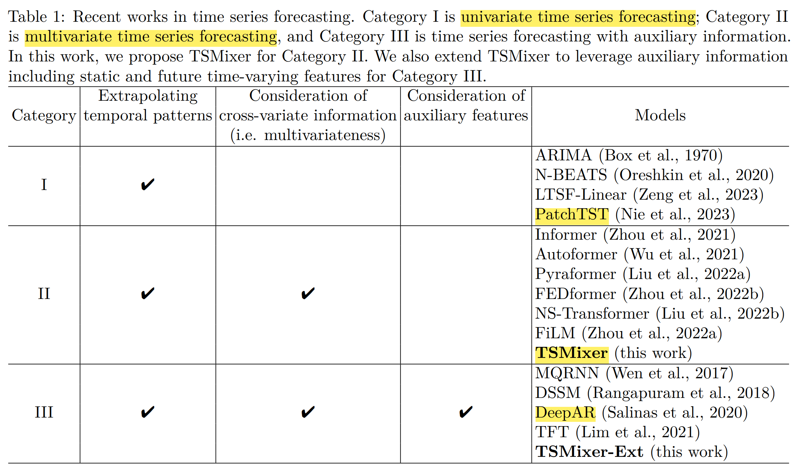
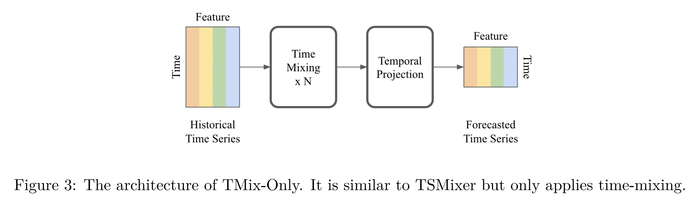
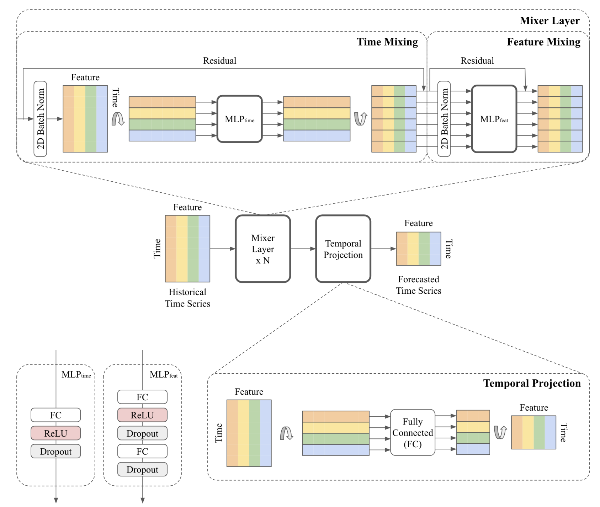
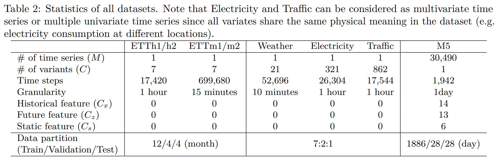
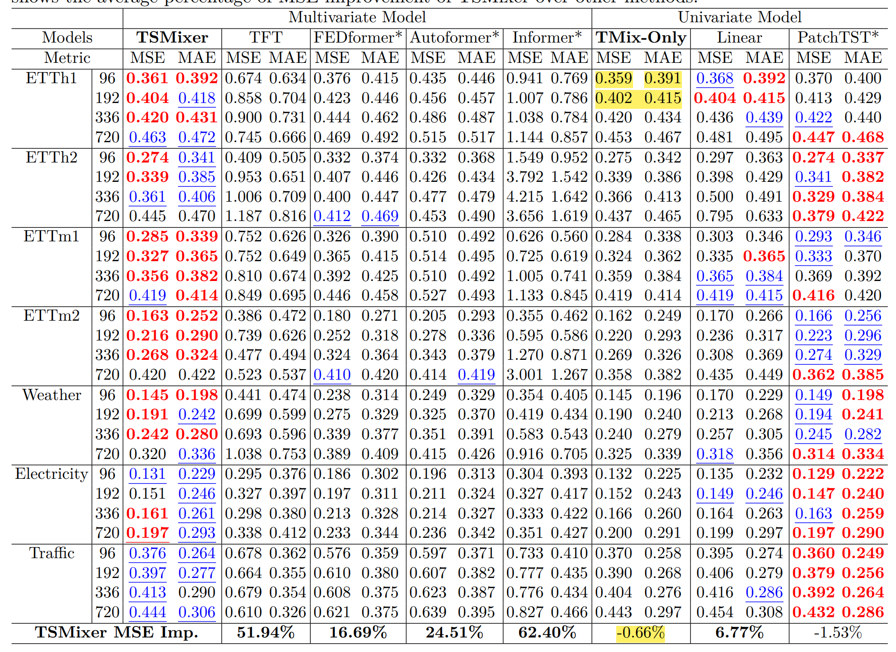
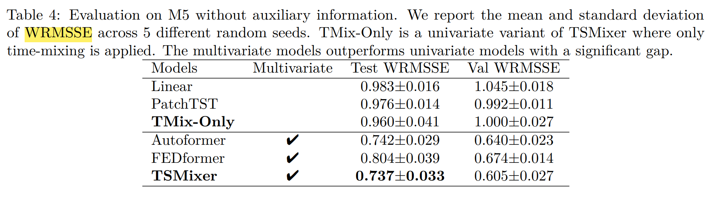
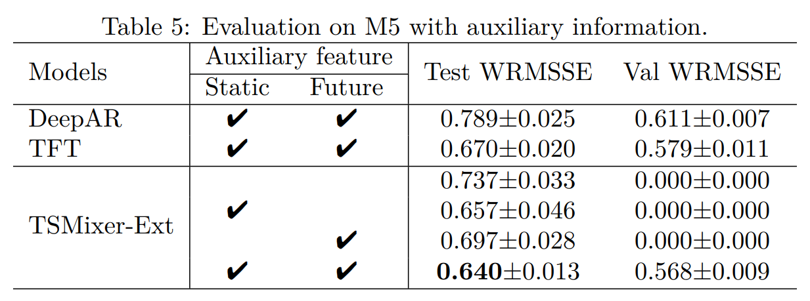
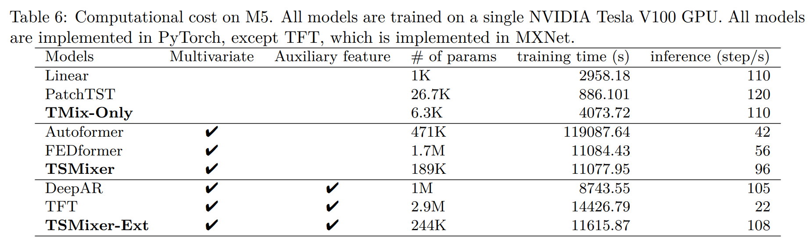

# Summary

- [Ideas](#ideas)
- [PatchTST - Nie et al. 2023](#patchtst)
- [TSMixer - Chen et al. 2023](#tsmixer)
- [TimeMachine - Ahamed 2024](#timemachine)
- [TimesNet - Wu et al. 2023](#timesnet)

Ideas

Ideas:

- Probabilistic Comparison:
  - Implementation:
    - parameters of distribution and specific loss (log loss?)
    - try different distributions
    - maybe try MonteCarlo
  - Evaluation:
    - Interval (WIS, Coverage)
    - full distribution (CRPS, WRMSSE)
- implement DMS (DLinear) method not IMS (DeepAR)
  - DMS architecture based on DeepAR possible?
- try CD over CI methods -> other evaluation benchmarks (like TSMixer)
  - methods to capture cross-channel information
    - CNN, RNN, ARIMA?
  - CNN/RNN in place of $MLP_{feat}$ of TSMixer
  - utilize TimesBlock from TimesNet
  - use patching, but dynamically (and potentially series dependent) determine the patch length to match the frequency of the underlying time series (maybe via FFT?) -> then feed patches to CNN/RNN to summarize the series information and implement it to the prediction of the target time series
  - maybe find a way to include a parameter $\lambda$ to trade-off between CI and CD
- train models with MAE compared to MSE, as it is more robust (according to Han et al. 2023)
- also consider auxiliary information -> again needs other benchmark than the standard (M5 like TSMixer)

PatchTST

TSMixer

Abstract

- However, recent work demonstrates that simple univariate linear models can outperform such deep learning models on several commonly used academic benchmarks.
- Extending them, in this paper, we investigate the capabilities of linear models for time-series forecasting and present Time-Series Mixer (TSMixer), a novel architecture designed by stacking multi-layer perceptrons (MLPs). TSMixer is based on mixing operations along both the time and feature dimensions to extract information efficiently
- comparable performance on academic benchmarks and superior performance on M5 benchmark
- results underline importance of efficiently utilizing cross-variate and auxiliary information

Introduction
- propose two models:
  - stacking temporal linear models with non-linearities (TMix-Only)
  - introducing cross-variate feed-forward layers (TSMixer) (applies MLPs across time and feature dimensions)
- The residual designs ensure that TSMixer retains the capacity of temporal linear models while still being able to exploit cross-variate information
- on academic datasets -> they show that stacking of linear models is very effective and that cross-series information is less important on these datasets. Also, they outperform the other multivariate models & are on par with univariate ones.
- on M5 -> cross-variate information is indeed useful, and implement design to use TSMixer with auxiliary information. Outperforms DeepAR and TFT

Related work
- propose that dataset bias of academic benchmark datasets mainly advocates for univariate models
- drawback of real-world models (DeepAR or TFT) is their complexity, especially in comparison with linear univariate models

Linear models
- We then compare linear models with other architectures and show that linear models have a characteristic not present in RNNs and Transformers – they have the appropriate representation capacity to learn the time dependency for a univariate time series.
- Linear models possess a unique characteristic wherein the weights of the mapping are fixed for each time step in the input sequence. This “time-step-dependent” characteristic is a crucial component of our previous findings and stands in contrast to recurrent or attention-based architectures, where the weights over the input sequence are outputs of a "data-dependent" function, such as the gates in LSTMs or attention layers in Transformers.
- Conversely, even though recurrent or attention architectures have high representational capacity, achieving time-step independence is challenging for them. They usually overfit on the data instead of solely considering the positions

TSMixer architecture
- propose natural enhancement of linear model -> stacking multiple linear models with non-linearities via MLPs
- additionally leverage cross-variate information apply MLPs in time and feature domain in alternating manner
- The time-domain MLPs are shared across all of the features, while the feature-domain MLPs are shared across all of the time steps
- architecture allows long look-back window length L, while parameter growth complexity is only O(L + C)
- To better understand the utility of cross-variate information and feature-mixing, we also consider a simplified variant of TSMixer that only employs time-mixing, referred to as TMix-Only, which consists of a residual MLP shared across each variate, see Figure below.

TSMixer (multivariate) architecture

- The columns of the inputs means different features/variates and the rows are time steps. The fully-connected operations are row-wise. TSMixer contains interleaving time-mixing and feature-mixing MLPs to aggregate information. The number of mixer layer is denoted as N. <b>The time-mixing MLPs are shared across all features and the feature-mixing MLPs are shared across all of the time steps.</b> The design allow TSMixer to automatically adapt the use of both temporal and cross-variate information with limited number of parameters for superior generalization. 

Extended TSMixer for Time Series Forecasting with Auxiliary Information
- We first design the align stage to project the feature with different shapes into the same shape. Then we can concatenate the features and seamlessly apply feature mixing on them. We extend TSMixer as illustrated in Fig. 4. The architecture comprises two parts: align and mixing. In the align stage, TSMixer aligns historical features ($R^{L×C_x}$ ) and future features ($R^{T×C_z}$) into the same shape ($R^{L×C_h}$) by applying temporal projection and a feature-mixing layer, where $C_h$ represents the size of hidden layers. Additionally, it repeats the static features to transform their shape from $R^{1×C_s}$ to $R^{T×C_s}$ in order to align the output length.

Experiments
- Data 
- Results (best=red, 2nd=blue, ** taken from Nie et al. 2023, TMix_only not highlighted) 
- use input length 512, Adam with <b>MSE objective</b> and apply RevIN

- M5: prediction length T=28, input length L=35, optimize log-likelihood of negative binomial distribution. Aggregate predictions at different levels and evaluate via weighted root mean squared scaled error (WRMSSE).
- without auxiliary data 
- with auxiliary data 
- computational cost 

TimeMachine

TimesNet

